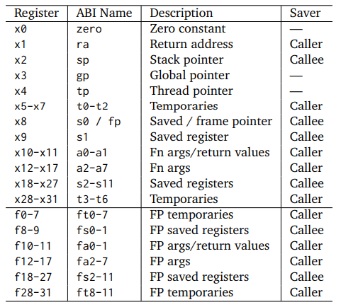
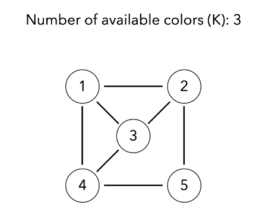

# Register Allocation

- 🧑‍💻 **Motivation**
- 📝 **Liveness Analysis**
- 🎨 **Graph Coloring**
- 🛠 **Coalecing**
---

# Motivation

- v1, v2...vn: local variables or virtual registers, unbounded.
- R0, …, Rn: machine registers, bounded.

---

# Motivation: RTL

````md magic-move {lines: true}

```asm
gcd: 
    v0  <- RA
    v1 <- R1
    v2 <- R2
loop:
    v3 <- done
    if v2 = 0 goto v3
    v4 <- v2
    v2 <- v1 % v2
    v1 <- v4
    v5 <- loop
    goto v5
done:
    R1 <- v1
    goto v0
```

```asm
gcd: 
    RA  <- RA
    R1 <- R1
    R2 <- R2
loop:
    R3 <- done
    if R2 = 0 goto v3
    R3 <- R2
    R2 <- R1 % R2
    R1 <- R3
    R3 <- loop
    goto R3
done:
    R1 <- R1
    goto RA
```

```asm {2-4,14}
gcd: 
    RA  <- RA
    R1 <- R1
    R2 <- R2
loop:
    R3 <- done
    if R2 = 0 goto v3
    R3 <- R2
    R2 <- R1 % R2
    R1 <- R3
    R3 <- loop
    goto R3
done:
    R1 <- R1
    goto RA
```

```asm
gcd: 
loop:
    R3 <- done
    if R2 = 0 goto v3
    R3 <- R2
    R2 <- R1 % R2
    R1 <- R3
    R3 <- loop
    goto R3
done:
    goto RA
```

````
---

# Motivation: Interference Graph

- Vertexes: variables or registers
- Edges: conflicts(variables which live at the same time)

<div style="display: flex; align-items: center;">
  
  
</div>

---

# Liveness Analysis

<div style="display: flex; align-items: center;">
<v-click>
<div style="text-align: center; margin-right: 4px;">
    <p>
        Basic: [first definition, last usage]
        <br>
        live interval of X = [4, 9]
    </p>
    
</div>
</v-click>
<v-click>
<div style="text-align: center; margin-right: 4px;">
    <p>
        Extension: [Basic] + [Jump Extendsion]
        <br>
        live interval of X = [4, 12]
    </p>
    
</div>
</v-click>
</div>
---

# Liveness Analysis: Control Flow Graph

<div style="display: flex; justify-content: center; align-items: center;">
````md magic-move {lines: true}

```cpp
int y1 = 1;
int r = x;
while (y1 != y) {
    int t = y1 * 2;
    if (t <= y) {
        r = r * r;
        y1 = y1 * 2;
    } else {
        r = r * x;
        y1 = y1 + 1;
    }
}
```

```haskell
flip :: (a -> b -> c) -> b -> a -> c
flip f b a = (f a) b 
```

```haskell
flip :: (a -> b -> c) -> b -> a -> c
flip f b a = (f a) b 

-- flip ~~> g
-- g : ??? 
```

````

</div>

---

# Liveness Analysis

$$
o_n = i_{s1} \cup i_{s2} \cup ... \cup i_{sk} \\
i_n = Use(n) \cup (o_n \setminus Def(n))
$$

<p align="center">

</p>

---

# Graph Coloring: Simplification 

- If the graph has at least one node with less than K neighbors, it is removed from the graph.
- Simplified graph is recursively colored.
- Once this is done, the node is colored with any color not used by its neighbors.



---

# Graph Coloring: Spilling 

- During coloring by simplification, it is perfectly possible to reach a point where all the nodes have at least K neighbors. When this occurs, one of them must be chosen to be spilled, i.e. have its value stored in memory instead of in a register.

- Spilling Code is different between CISC and RISC.

<br>

<v-click>

<code>v0 = v1 + v2</code>

CISC: <code>M\[SP\] = M\[SP - 4\] + M\[SP - 8\]</code>

RISC: <span v-mark.strike-through.red="2"><code>M\[SP\] = M\[SP - 4\] + M\[SP - 8\]</code> </span>


</v-click>
---

# Graph Coloring: Spilling 


-
---

# Coalecing 


-